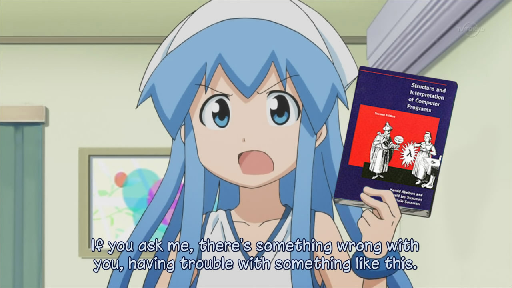

# 💙 Cam1227x 💙

	 
	<i>Programming <3</i>
	

	
---

### ❓ About Me:
* Sixteen year old Low-Level programmer, linux user, ethical hacker, and overall computer geek 💻.
* 🎵 Rhythm game player (4-key VSRG for the past month) 🎵
* 🙃 Open Source Makes me happy 🐧
* Foxes are the dominant animal 🦊
* 😁 Improving everyday!

 
<h3>📚 About me (In Depth):</h3>

I'm a sixteen year old Low-Level programmer, linux user, ethical hacker, and overall computer geek 💻. The first time I programmed was when I was 12. I got into
programming because all I always wanted to be able to (as nerdy as it sounds...) create operating system, program applications, and create game hacks! I had a really
weird experience with programming in the beginning, which ended up with me quiting, and I switched to study ⚡ electrical engineering ⚡ instead. Which, was difficult but
very enjoyable! But I still knew that I wanted to be able to program amazing things, so I endedup comming back to programming, and started learning C & C++. As of
recently, I Really enjoy learning about systems-level programming, and am currently learning kernel development. I plan to continue learning C, C++ and Assembly, as well
as learn languages like Rust, Zig, and typescript in the future. I also really enjoy participating in online cyber-security competitions, as well as game jams 👾. 
Thanks for checking my page out =)!

---

### 🪛 Languages & Tools:
 
